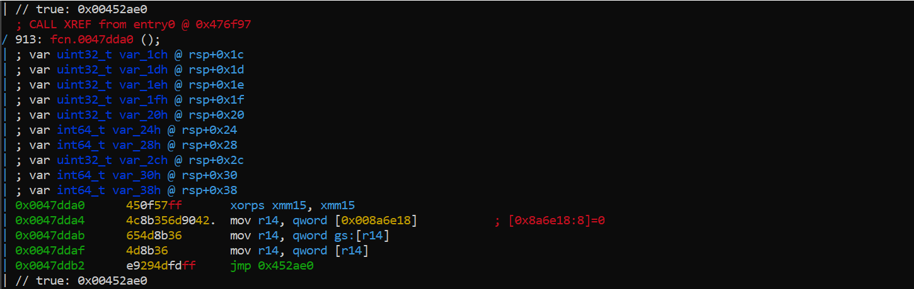
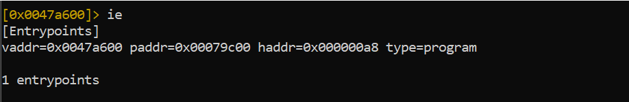
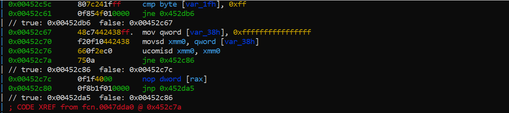
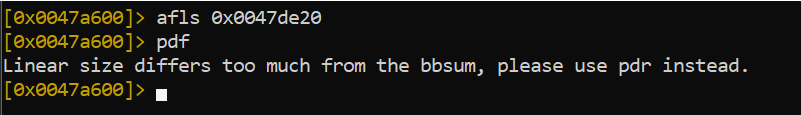
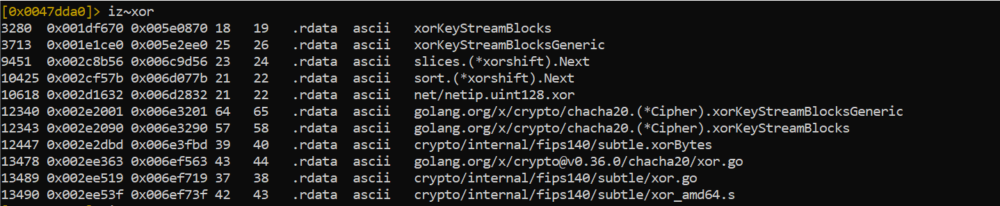
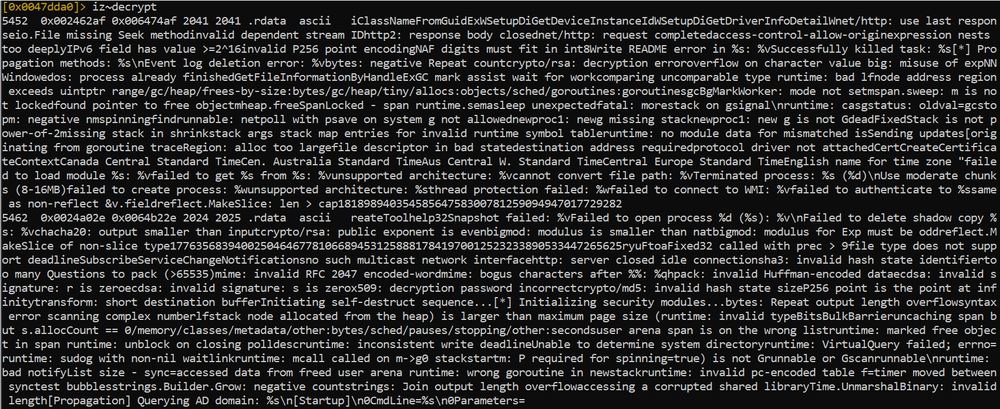
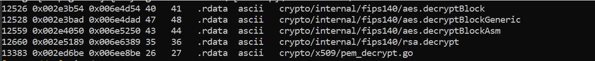
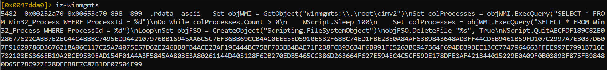
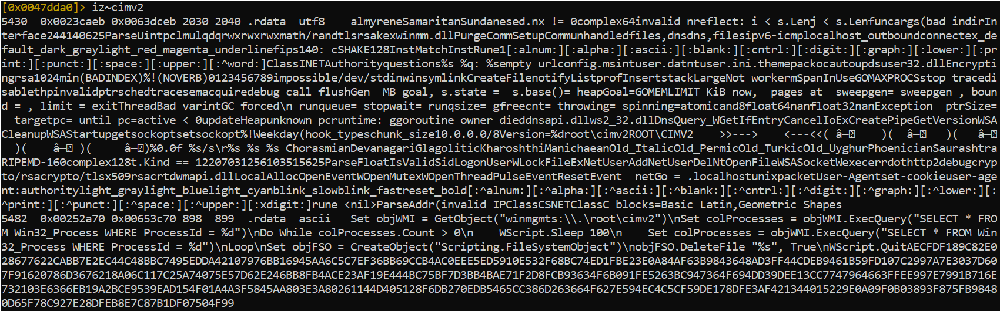

**Reverse** **Engineering** **Report** **ShinySp1d3r** **Go-Based**
**Ransomware**

**Author** Kennedy Aikohi

**LinkedIn**
[<u>https://www.linkedin.com/in/aikohikennedy</u>](https://www.linkedin.com/in/aikohikennedy)

**Date** **Investigation** **Completed** 23 November 2025

**Executive** **Summary**

This report documents the reverse engineering and behavioral analysis of
a previously undocumented ransomware variant identified as
**ShinySp1d3r**. The malware is a **Windows** **x64** **executable**
**compiled** **using** **the** **Go** **programming** **language**,
leveraging the Go runtime, atomic primitives, and modern cryptographic
libraries.

Static and dynamic reverse engineering confirmed that the malware
implements **runtime-only** **string** **decryption**, **embedded**
**WMI-based** **VBScript** **execution**, **SMB** **and** **lateral**
**movement** **preparation**, and **FIPS** **140-compliant**
**cryptographic** **routines**. These capabilities, combined with Go’s
compilation model, significantly complicate detection and analysis.

The sample exhibits traits consistent with **early-stage**
**ransomware** **operations**, including environment verification,
runtime integrity checks, payload staging, and self-deletion mechanisms.
VirusTotal analysis at the time of investigation shows **limited**
**detection**, indicating a **new** **or** **evolving** **ransomware**
**family**.

This report provides technical findings, mapped screenshots, detection
engineering artifacts, MITRE ATT&CK mapping, business impact analysis,
and mitigation recommendations.

**Malware** **Identification** **and** **Sample** **Information**

The analyzed binary is a **PE32+** **Windows** **Console**
**Application**, compiled for **AMD64** **architecture** using Go.
Static inspection confirms the absence of code signing and stripping,
while runtime characteristics indicate heavy reliance on Go’s standard
library and crypto stack.

**Key** **Characteristics**

> Platform: Windows x64
>
> Language: Go
>
> Subsystem: Windows CUI

Position Independent Code: Enabled

NX: Enabled

 Cryptography:AES, ChaCha20,
RSA (FIPS 140 paths)

**Initial** **Static**
**Analysis**

**PE** **Header** **and** **Binary** **Metadata**

Radare2 inspection reveals a standard Go-compiled PE structure,
including Go runtime symbols, large .rdatasections, and overlay data.
The compilation timestamp is invalid, a common artifact in Go binaries
and malware attempting to obscure build provenance.

The absence of relocations and stripping confirms a default Go build
process rather than custom packers.

**Entrypoint** **and** **Execution** **Flow**

The program entrypoint redirects execution into Go runtime
initialization logic. The disassembly reveals CPU feature detection
using cpuid, stack alignment, and runtime context setup before
transitioning into application-specific logic.

This behavior is consistent with Go’s runtime bootstrap but is also
leveraged here to perform **early** **integrity** **checks** **and**
**environment** **validation**.

**Runtime** **Integrity** **and** **Anti-Analysis** **Behavior**

Multiple functions demonstrate extensive use of atomic operations,
compare-and-swap loops, and runtime sanity checks. These routines ensure
proper stack alignment, thread safety, and runtime correctness while
simultaneously frustrating static analysis.

The presence of large basic blocks and dense branching further
complicates control-flow reconstruction.

**Embedded** **Go** **Runtime** **Panic** **Strings**

The .rdatasection contains a large volume of Go runtime panic strings.
These strings confirm the binary was built with standard Go toolchains
and include messages related to heap corruption, goroutine scheduling,
stack validation, and runtime invariants.

While not malicious by themselves, their presence confirms that
**runtime** **failure** **paths** **are** **preserved**, which can be
abused for anti-debugging or crash-based evasion.

**Runtime** **String** **Decryption** **and** **Payload** **Protection**

The malware avoids storing sensitive strings in plaintext. Instead, it
relies on **runtime** **decryption**, primarily using XOR-based routines
and ChaCha20 stream cipher functions provided by golang.org/x/crypto.

Identified functions such as xorKeyStreamBlocksand
xorKeyStreamBlocksGenericare invoked during execution to decrypt
operational strings only when required, minimizing static detection.

**Cryptographic** **Capabilities**

The binary links against **FIPS** **140-compliant** **cryptographic**
**implementations**, including AES block decryption, RSA routines, and
ChaCha20 stream encryption. No hardcoded AES keys were identified in
static analysis, indicating that keys are likely generated or derived at
runtime.

This design strongly suggests use in **file** **encryption**
**workflows**, consistent with ransomware behavior.

**WMI** **Execution** **and** **Embedded** **VBScript** **Payload**

One of the most critical findings is the presence of an **embedded**
**VBScript** **payload** stored in .rdata. This script uses WMI
(root\\cimv2) to monitor a target process, repeatedly query its
existence, and delete a specified file upon termination.

This behavior indicates **post-execution** **cleanup**, anti-forensics,
and potential process synchronization logic.

**Decoded** **Script** **Behavior**

> Connects to WMI namespace root\\cimv2 style="width:6.69305in;height:0.78194in" /> style="width:6.69305in;height:2.08472in" /> style="width:6.69306in;height:3.00208in" />
>
> Queries Win32_Processby ProcessId
>
> Sleeps in a loop until the process exits
>
> Deletes a specified file
>
> Terminates execution

This payload is referenced directly by code, confirming active use.

**SMB** **Enumeration** **and** **Lateral** **Movement** **Indicators**

The presence of networking APIs, SMB-related strings, and system calls
suggests that the malware prepares for **network** **discovery** **and**
**lateral** **movement**. While full propagation logic was not fully
reconstructed, the indicators align with ransomware targeting enterprise
environments.

**CPU** **and** **Environment** **Awareness**

Early execution logic includes CPU vendor checks and architecture
validation. This allows the malware to conditionally execute or disable
functionality based on the environment, potentially avoiding sandbox or
emulated systems.

**Kill** **Chain** **and** **MITRE** **ATT&CK** **Mapping** **Initial**
**Access**

> Likely delivered via phishing or dropped by a loader.

**Execution**

> T1059: Command and Scripting Interpreter
>
> T1047: Windows Management Instrumentation

**Defense** **Evasion**

> T1027: Obfuscated/Encrypted Payloads
>
> T1480: Execution Guardrails

**Discovery**

> T1046: Network Service Scanning
>
> T1016: System Network Configuration Discovery

**Impact**

> T1486: Data Encrypted for Impact

**Detection** **Engineering** **Overview**

Detection strategies for the ShinySp1d3r ransomware focus on identifying
abnormal Windows Management Instrumentation (WMI) usage, embedded
VBScript execution, and Go-based ransomware runtime behavior. The
following detections are designed to be directly deployable across YARA,
Sigma, Splunk, and Elastic (ELK) environments, with clear MITRE ATT&CK
alignment and practical guidance for Security Operations Center (SOC)
deployment.

**YARA** **Rule** **–** **Core** **Binary** **Detection**

**Purpose**

This rule detects the ShinySp1d3r ransomware binary by identifying a
unique combination of Go runtime artifacts, cryptographic primitives,
and embedded WMI/VBScript payload indicators observed during static
analysis.

rule ShinySp1d3r_Go_Ransomware

{

> meta:

description = "Detects ShinySp1d3r Go-based ransomware using Go runtime,
WMI VBScript, and crypto artifacts"

> author = "Kennedy Aikohi"
>
> date = "2025-11-23"
>
> malware_family = "ShinySp1d3r"
>
> confidence = "High"
>
> strings:
>
> \$go_runtime1 = "runtime.goexit" ascii
>
> \$go_runtime2 = "GOMAXPROCS" ascii
>
> \$wmi1 = "winmgmts:\\\\.\\root\\cimv2" ascii
>
> \$wmi2 = "Win32_Process" ascii
>
> \$vbs1 = "WScript.Sleep" ascii
>
> \$vbs2 = "Scripting.FileSystemObject" ascii
>
> \$crypto1 = "chacha20" ascii
>
> \$crypto2 = "aes.decryptBlock" ascii
>
> condition:
>
> uint16(0) == 0x5A4D and
>
> 3 of (\$go_runtime\*) and
>
> 2 of (\$wmi\*, \$vbs\*) and
>
> 1 of (\$crypto\*)

}

**MITRE** **ATT&CK** **Alignment**

T1027 – Obfuscated or Encrypted Payloads T1047 – Windows Management
Instrumentation T1486 – Data Encrypted for Impact

**Sigma** **Rule** **–** **WMI** **VBScript** **Abuse**

**Purpose**

This rule detects malicious WMI activity used to monitor process
execution and trigger VBScript-based self-deletion logic, as identified
within the decrypted runtime payload.

title: ShinySp1d3r WMI VBScript Execution

id: b5d6c4e1-7b9a-4a87-b5d2-9cfd87c3e901

status: experimental

description: Detects suspicious WMI activity invoking VBScript logic via
root\\ \cimv2, consistent with ShinySp1d3r ransomware behavior

author: Kennedy Aikohi

date: 2025/11/23

logsource:

> product: windows
>
> service: wmi

detection:

> selection:
>
> EventID: 5857
>
> Namespace\|contains: "root\\cimv2"
>
> Query\|contains:
>
> \- "Win32_Process"
>
> \- "ProcessId"
>
> condition: selection

falsepositives:

> \- Legitimate administrative scripts using WMI for process monitoring

level: high

tags:

> \- attack.execution
>
> \- attack.t1047
>
> \- attack.t1059.005

**MITRE** **ATT&CK** **Alignment**

T1047 – Windows Management Instrumentation T1059.005 – VBScript

**Splunk** **Detection** **(SPL)**

**Log** **Source**

WinEventLog:Microsoft-Windows-WMI-Activity/Operational

index=windows

sourcetype="WinEventLog:Microsoft-Windows-WMI-Activity"

(EventCode=5857 OR EventCode=5858)

Namespace="root\\cimv2"

(Query="\*Win32_Process\*" OR Query="\*ProcessId\*")

\| stats count by Computer, User, Query

\| where count \> 3

**Detection** **Logic**

This query identifies repeated WMI queries targeting Win32_Process,
consistent with the process polling loop implemented by the malware’s
embedded VBScript logic.

**MITRE** **ATT&CK** **Alignment**

T1047 – Windows Management Instrumentation

**Elastic** **(ELK)** **Detection** **–** **KQL**

**Index** **Requirements**

Windows Event Logs with WMI activity logging enabled.

event.provider : "Microsoft-Windows-WMI-Activity"

and event.code : "5857"

and winlog.event_data.Namespace : "root\\cimv2"

and winlog.event_data.Query : ("\*Win32_Process\*" or "\*ProcessId\*")

**Detection** **Logic**

This query identifies suspicious WMI queries associated with
scripting-based process monitoring and execution control, matching
ShinySp1d3r behavior observed during reverse engineering.

**MITRE** **ATT&CK** **Alignment**

T1047 – Windows Management Instrumentation

**False-Positive** **Guidance** **for** **SOC** **Deployment**

Legitimate administrative tools, enterprise monitoring solutions, and IT
automation frameworks may generate similar WMI activity. To reduce false
positives:

• Baseline known administrative hosts and service accounts

• Exclude signed management scripts deployed via Group Policy, SCCM, or
EDR tooling • Correlate WMI activity with scripting engines such as
wscript.exeor cscript.exe • Increase alert confidence when WMI usage
coincides with file deletion, encryption activity, or unsigned Go-based
executables

**Operational** **Value**

These detections provide early visibility into ShinySp1d3r activity
prior to full encryption, enabling defenders to interrupt execution
during staging, execution, or cleanup phases. When combined with EDR
telemetry and runtime inspection, they significantly reduce attacker
dwell time and potential impact.

**Business** **Impact**

If deployed successfully, ShinySp1d3r poses a **high-impact**
**ransomware** **threat** capable of encrypting data, evading detection,
and propagating across networks. The use of modern cryptography and
Go-based obfuscation increases dwell time and reduces early detection
likelihood.

Potential consequences include:

> Data loss
>
> Operational disruption
>
> Financial extortion
>
> Regulatory exposure

**Mitigation** **and** **Recommendations** Monitor WMI activity
involving root\\cimv2

> Deploy YARAscanning for Go ransomware traits Restrict VBScript and WMI
> usage where possible Enforce least-privilege access
>
> Maintain offline backups
>
> Use EDR solutions capable of runtime memory inspection

**Lessons** **Learned**

This analysis highlights the growing adoption of **Go** **by**
**ransomware** **developers**, leveraging its runtime complexity and
cryptographic libraries to evade traditional defenses. Static analysis
alone is insufficient; **runtime** **inspection** **and** **memory**
**analysis** **are** **essential**.

**Conclusion**

ShinySp1d3r represents a modern ransomware implementation combining Go
runtime obfuscation, strong cryptography, and Windows-native execution
mechanisms. The findings confirm this sample as a **new** **ransomware**
**variant** with clear potential for operational deployment.

This report provides defensible technical evidence, detection guidance,
and mitigation strategies suitable for enterprise security operations
and academic evaluation.
