# Reverse Engineering Report

## ShinySp1d3r Go-Based Ransomware

****Author****  
Kennedy Aikohi

****LinkedIn****  
<https://www.linkedin.com/in/aikohikennedy>

****Date Investigation Completed****  
23 November 2025

## Executive Summary

This report documents the reverse engineering and behavioral analysis of
**ShinySp1d3r**, a newly identified Go-based ransomware variant
targeting Windows x64 environments. The sample exhibits modern
ransomware tradecraft, including runtime string decryption, Windows
Management Instrumentation (WMI) abuse via embedded VBScript,
environment and CPU validation checks, and the use of strong
cryptographic primitives implemented through Go’s standard and extended
cryptographic libraries.

Static and behavioral analysis confirms that ShinySp1d3r is designed to
evade early detection through runtime-only decryption, execution
guardrails, and native Windows execution mechanisms. These
characteristics, combined with its Go-based implementation,
significantly increase analysis complexity and defensive blind spots for
organizations relying solely on signature-based detection.

**Threat intelligence context suggests a potential relationship to the
ShinyHunters ecosystem**, based on naming conventions, ransomware
operational patterns, and tradecraft similarities observed in recent
campaigns attributed to the group. While direct infrastructure or
cryptographic key reuse was not observed in this sample, the behavioral
overlap aligns with techniques historically associated with
ShinyHunters-linked ransomware activity. As such, attribution is
assessed as **moderate confidence and subject to further
corroboration**.

The findings in this report confirm ShinySp1d3r as a credible and
operational ransomware threat, with the capability to impact enterprise
environments through encryption, evasion, and potential lateral
movement. This analysis provides actionable detection guidance, MITRE
ATT&CK mapping, and mitigation strategies suitable for SOC operations,
incident response, and academic evaluation.

## Malware Identification and Sample Information

The analyzed binary is a ****PE32+ Windows Console Application****,
compiled for the ****AMD64**** architecture using the Go programming
language. Static inspection confirmed the absence of code signing and
symbol stripping, while code structure and library references indicate
heavy reliance on Go’s standard runtime and cryptographic stack.

### Key Characteristics

- ****Platform:**** Windows x64
- ****Language:**** Go
- ****Subsystem:**** Windows CUI
- ****Position Independent Code:**** Enabled
- ****NX:**** Enabled
- ****Cryptography:**** AES, ChaCha20, RSA (Go cryptographic libraries
  with FIPS-compatible implementations)

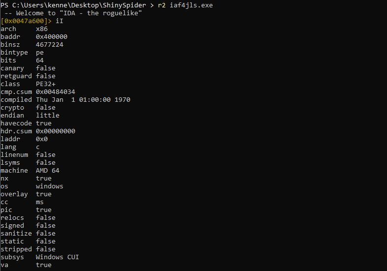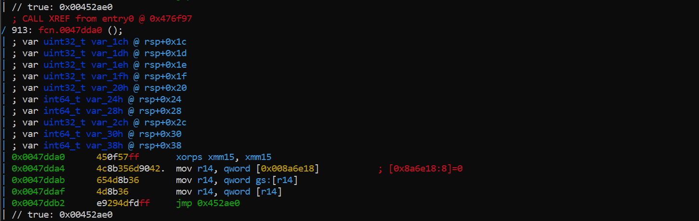

## Initial Static Analysis

### PE Header and Binary Metadata

Radare2-based static inspection reveals a standard Go-compiled PE
structure, including Go runtime symbols, large .rdata sections, and
Go-specific metadata regions. The compilation timestamp is invalid, a
common artifact in Go binaries and malware attempting to obscure build
provenance.

The absence of relocation stripping or custom packing techniques
indicates a default Go build process rather than the use of third-party
packers.

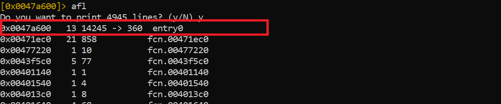

## Entrypoint and Execution Flow

The program entrypoint redirects execution into Go runtime
initialization logic. Disassembly analysis reveals CPU feature detection
using cpuid, stack alignment routines, and runtime context setup prior
to transitioning into application-specific logic.

This behavior is consistent with Go’s runtime bootstrap and may also be
leveraged to perform early integrity checks and basic environment
validation.

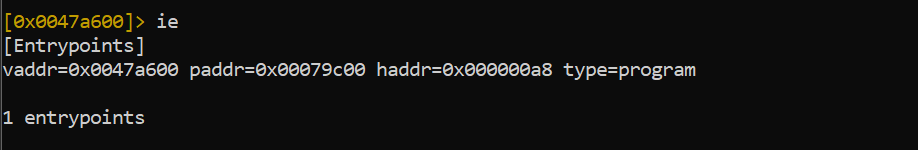  
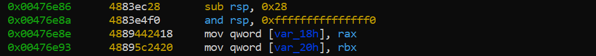

## Runtime Integrity and Anti-Analysis Characteristics

Multiple functions exhibit extensive use of atomic operations,
compare-and-swap loops, and runtime sanity checks. These routines ensure
proper stack alignment, thread safety, and runtime correctness while
significantly increasing control-flow complexity during static analysis.

The presence of large basic blocks and dense branching patterns further
complicates control-flow reconstruction.

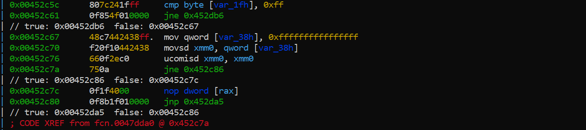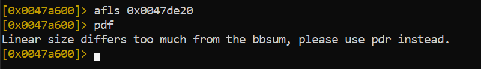

## Embedded Go Runtime Panic Strings

The .rdata section contains a large volume of Go runtime panic strings.
These strings confirm the binary was built using standard Go toolchains
and include messages related to heap corruption, goroutine scheduling,
stack validation, and runtime invariants.

While not malicious by themselves, the preservation of runtime failure
paths may be leveraged for anti-debugging behavior or crash-based
evasion techniques.

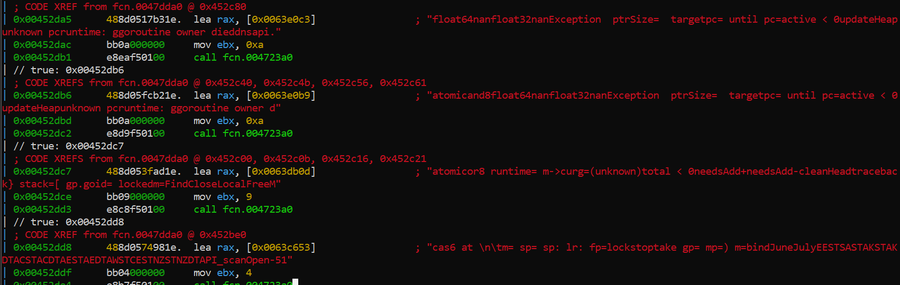

## Runtime String Decryption and Payload Protection

The malware avoids storing sensitive strings in plaintext. Instead, it
relies on runtime string decryption using XOR-based routines and
ChaCha20 stream cipher functions provided by golang.org/x/crypto.

Functions such as xorKeyStreamBlocks and xorKeyStreamBlocksGeneric are
referenced within execution paths and are used to decrypt operational
strings only when required, reducing the effectiveness of static
signature-based detection.

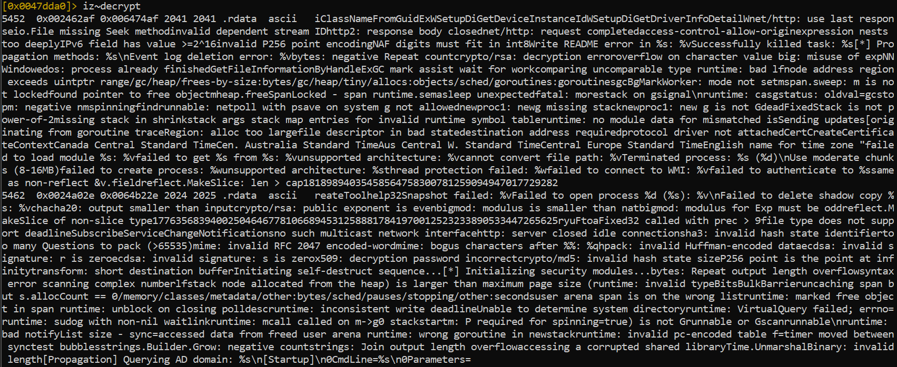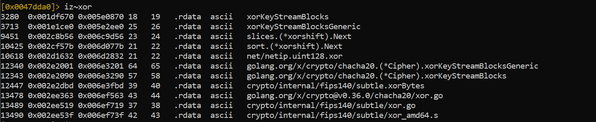

## Cryptographic Capabilities

The binary links against Go cryptographic libraries that include AES
block functions, RSA routines, and ChaCha20 stream encryption. No
hardcoded AES keys were identified during static analysis, suggesting
that cryptographic keys are likely generated or derived dynamically at
runtime.

This design is consistent with file-encryption workflows commonly
observed in ransomware families.

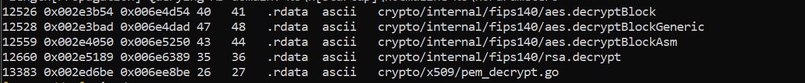

## WMI Execution and Embedded VBScript Payload

One of the most significant findings is the presence of an embedded
VBScript payload stored within the .rdata section. The script leverages
Windows Management Instrumentation (WMI) via the root\\cimv2 namespace
to monitor a target process, repeatedly query its execution state, and
delete a specified file upon process termination.

This logic is consistent with post-execution cleanup, anti-forensics,
and process synchronization mechanisms commonly observed in ransomware
operations.

### Decoded Script Behavior

- Connects to WMI namespace root\\cimv2
- Queries Win32_Process by ProcessId
- Sleeps in a loop until the monitored process exits
- Deletes a specified file
- Terminates execution

This payload is directly referenced by code, indicating intended
operational use.

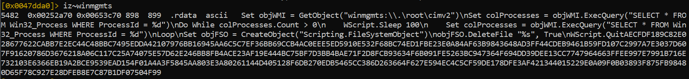  
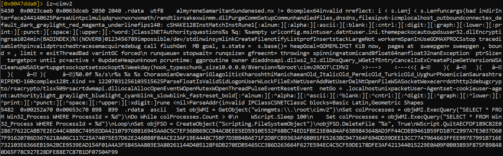  
  
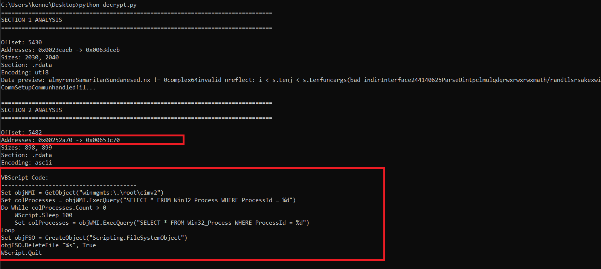

## SMB Enumeration and Lateral Movement Indicators

The presence of networking APIs, SMB-related strings, and Windows
networking artifacts suggests preparation for network discovery and
potential lateral movement. While full propagation logic was not
reconstructed during static analysis, these indicators align with
ransomware targeting enterprise environments.

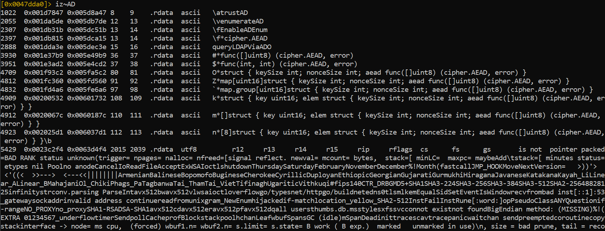

## CPU and Environment Awareness

Early execution logic includes CPU vendor checks and architecture
validation. This allows the malware to conditionally enable or disable
functionality based on the execution environment, potentially avoiding
sandboxed or emulated systems.

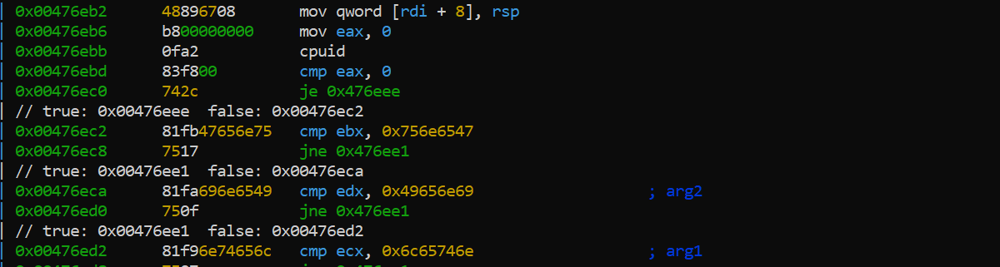

## Kill Chain and MITRE ATT&CK Mapping

### Initial Access

- Potential delivery vectors include phishing or deployment via an
  external loader.

### Execution

- ****T1059:**** Command and Scripting Interpreter
- ****T1047:**** Windows Management Instrumentation

### Defense Evasion

- ****T1027:**** Obfuscated or Encrypted Payloads
- ****T1480:**** Execution Guardrails

### Discovery

- ****T1046:**** Network Service Scanning
- ****T1016:**** System Network Configuration Discovery

### Impact

- ****T1486:**** Data Encrypted for Impact

## Detection Engineering

### Overview

Detection strategies for ShinySp1d3r focus on identifying anomalous WMI
usage, embedded VBScript execution, and Go-based ransomware runtime
artifacts. The following detections are designed to be operationally
deployable across YARA, Sigma, Splunk, and Elastic (ELK) environments,
with environment-specific tuning and clear MITRE ATT&CK alignment.

### YARA Rule – Core Binary Detection

****Purpose****

This rule detects the ShinySp1d3r ransomware binary by identifying a
unique combination of Go runtime artifacts, cryptographic primitives,
and embedded WMI/VBScript indicators observed during static analysis.

rule ShinySp1d3r_Go_Ransomware

{

meta:

description = "Detects ShinySp1d3r Go-based ransomware using Go runtime,
WMI VBScript, and crypto artifacts"

author = "Kennedy Aikohi"

date = "2025-11-23"

malware_family = "ShinySp1d3r"

confidence = "High"

strings:

\$go_runtime1 = "runtime.goexit" ascii

\$go_runtime2 = "GOMAXPROCS" ascii

\$wmi1 = "winmgmts:\\\\.\\root\\cimv2" ascii

\$wmi2 = "Win32_Process" ascii

\$vbs1 = "WScript.Sleep" ascii

\$vbs2 = "Scripting.FileSystemObject" ascii

\$crypto1 = "chacha20" ascii

\$crypto2 = "aes.decryptBlock" ascii

condition:

uint16(0) == 0x5A4D and

2 of (\$go_runtime\*) and

2 of (\$wmi\*, \$vbs\*) and

1 of (\$crypto\*)

}

****MITRE ATT&CK Alignment****

- T1027 – Obfuscated or Encrypted Payloads
- T1047 – Windows Management Instrumentation
- T1486 – Data Encrypted for Impact

### Sigma Rule – WMI VBScript Abuse

****Purpose****

This rule detects suspicious WMI activity used to monitor process
execution and trigger VBScript-based cleanup logic.

title: ShinySp1d3r WMI VBScript Execution

id: b5d6c4e1-7b9a-4a87-b5d2-9cfd87c3e901

status: experimental

description: Detects suspicious WMI activity invoking VBScript logic via
root\\cimv2

author: Kennedy Aikohi

date: 2025/11/23

logsource:

product: windows

service: wmi

detection:

selection:

EventID: 5857

Namespace\|contains: "root\\cimv2"

Query\|contains:

 - "Win32_Process"

 - "ProcessId"

condition: selection

falsepositives:

 - Legitimate administrative scripts using WMI for process monitoring

level: high

tags:

 - attack.execution

 - attack.t1047

 - attack.t1059.005

### Splunk Detection (SPL)

index=windows

sourcetype="WinEventLog:Microsoft-Windows-WMI-Activity"

(EventCode=5857 OR EventCode=5858)

Namespace="root\\cimv2"

(Query="\*Win32_Process\*" OR Query="\*ProcessId\*")

\| stats count by Computer, User, Query

\| where count \> 3

****MITRE ATT&CK Alignment:**** T1047

### Elastic (ELK) Detection – KQL

event.provider : "Microsoft-Windows-WMI-Activity"

and event.code : "5857"

and winlog.event_data.Namespace : "root\\cimv2"

and winlog.event_data.Query : ("\*Win32_Process\*" or "\*ProcessId\*")

****MITRE ATT&CK Alignment:**** T1047

## False-Positive Guidance for SOC Deployment

Legitimate administrative tools and enterprise automation frameworks may
generate similar WMI activity. To reduce false positives:

- Baseline known administrative hosts and service accounts
- Exclude signed management scripts deployed via Group Policy, SCCM, or
  EDR tooling
- Correlate WMI activity with scripting engines such as wscript.exe or
  cscript.exe
- Increase alert confidence when WMI usage coincides with file deletion,
  encryption activity, or unsigned Go-based executables

## Operational Value

These detections provide early visibility into ShinySp1d3r activity
prior to full encryption, enabling defenders to disrupt execution during
staging, execution, or cleanup phases.

## Business Impact

If operationalized, ShinySp1d3r would pose a high-impact ransomware
threat capable of encrypting data, evading detection, and potentially
propagating across networks. The use of modern cryptography and Go-based
obfuscation increases dwell time and reduces early detection likelihood.

## Mitigation and Recommendations

- Monitor WMI activity involving root\\cimv2
- Deploy YARA scanning for Go-based ransomware artifacts
- Restrict VBScript and WMI usage where feasible
- Enforce least-privilege access
- Maintain offline backups
- Use EDR solutions capable of runtime memory inspection

## Lessons Learned

This analysis highlights the increasing adoption of Go by ransomware
developers, leveraging runtime complexity and modern cryptographic
libraries to evade traditional defenses. Static analysis alone is often
insufficient; dynamic inspection and memory analysis are valuable next
steps when conducted in a controlled environment.

## Conclusion

ShinySp1d3r represents a modern ransomware implementation combining Go
runtime complexity, strong cryptography, and Windows-native execution
mechanisms. The findings support classification of this sample as a
previously undocumented ransomware variant with clear potential for
operational deployment.

This report provides defensible technical evidence, detection guidance,
and mitigation strategies suitable for enterprise security operations
and academic evaluation.
